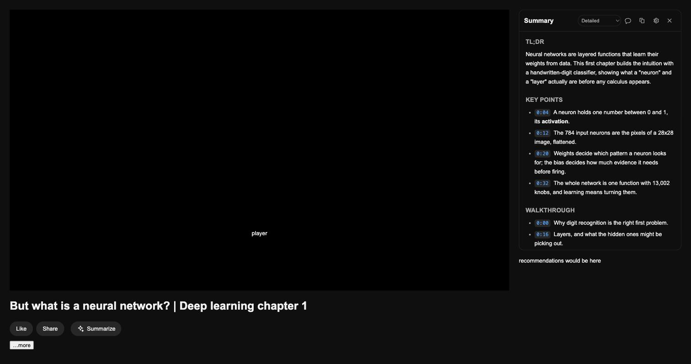

# Video Summary

A Chrome extension that adds a **Summarize** button to YouTube watch pages. It
reads the video's own caption track, sends it to an AI provider you configured
with your own API key, and streams back a structured summary.

The reason to use this instead of pasting a transcript into a chatbot: **every
timestamp in the summary is a link that seeks the player**. A chatbot can tell
you the interesting part is somewhere around eighteen minutes in. This puts you
there.



## Install

There is no store listing and no build step. Clone and load the folder.

```sh
git clone https://github.com/olivervanderlugt/video-summary-extension.git
cd video-summary-extension
```

1. Open `chrome://extensions`
2. Turn on **Developer mode** (top right)
3. Click **Load unpacked**
4. Select the `video-summary-extension` folder you just cloned
5. Click the extension's icon in the toolbar, then **Settings**
6. Pick a provider, paste your API key, and press **Test this key**

If the icons are missing, generate them first — see
[Generating the icons](#generating-the-icons).

## Getting a key

You need an account and a key with one of these. You pay them directly; this
extension never sees a cent and never sees your key.

| Provider | Where to get a key |
| --- | --- |
| Anthropic (Claude) | <https://console.anthropic.com/settings/keys> |
| OpenAI | <https://platform.openai.com/api-keys> |
| Google Gemini | <https://aistudio.google.com/app/apikey> |
| OpenAI-compatible | Whatever your server issues — Ollama, LM Studio, vLLM, OpenRouter, Together, and similar. Local servers usually need no key at all; you enter the server's base URL instead. |

Google's AI Studio has a free tier at the time of writing, which makes Gemini
the cheapest way to try this.

## What it costs

You are billed by your provider, per request, with no markup. The cost is driven
almost entirely by the transcript length.

A 30-minute video is roughly 4,500 spoken words, which is about 6,000 input
tokens, plus 1,000–2,000 tokens of summary out. In practice that lands somewhere
between a fraction of a cent on a small, fast model and a few cents on a large
one. A three-hour podcast is roughly six times that, and gets chunked into
sections first, which costs a little more again.

Two things keep the bill boring: "Automatically summarise when I open a video"
is off by default, so nothing is ever spent without a click, and you can set a
hard spend limit on the key in your provider's console.

## Limitations, stated up front

- **It needs captions.** The extension reads the caption track YouTube already
  serves. YouTube's automatic captions count, and most sizeable channels have
  them — but plenty of videos have no track at all, and those cannot be
  summarised. There is no audio transcription in this version.
- **Auto-captions mishear things.** Names, jargon, and acronyms come through
  wrong. The summary is instructed to flag proper nouns it is unsure of rather
  than invent a spelling, but treat every name in a summary of an auto-captioned
  video as approximate.
- **Watch pages only.** `youtube.com/watch`. Not Shorts, not playlists as a
  unit, not embeds, not YouTube Music.
- **Chromium browsers only.** Chrome, Edge, Brave, and other Chromium forks with
  Manifest V3. No Firefox or Safari port.
- **It is a summary.** It compresses, and compression loses things. The
  timestamps exist so you can check it.

## Privacy

The extension has no server and collects nothing. The only data that leaves your
browser is the video's title, channel, duration, chapters, and caption text, sent
to the one AI provider you configured, when you click the button. Your key is
stored locally in `chrome.storage.local` and never syncs to Google.

Full detail in [PRIVACY.md](PRIVACY.md).

## Security

Read this before pasting a key anywhere, including here.

Your API key is stored in `chrome.storage.local`, **unencrypted**. Anyone with
access to your Chrome profile directory can read it, exactly as they could read
the passwords Chrome has saved for you. This extension does not claim to encrypt
it, because encrypting a key while storing the passphrase beside it in the same
extension is theatre, not security.

What the design does do:

- The key is held and used only by the background service worker. It is never
  passed to the content script or to the YouTube page, so no script running on
  youtube.com — YouTube's own or anyone else's — can read it.
- The key is written to `chrome.storage.local`, never `chrome.storage.sync`, so
  it is never uploaded to your Google account.
- The only outbound requests are to the provider you configured. No analytics,
  no telemetry, no remote code, no external fonts or scripts.
- The transcript is passed to the model inside a delimited block with an explicit
  instruction that it is data and not instruction, and the closing delimiter is
  stripped from the transcript first, so a video cannot close the block early and
  address the model directly.
- Model output is rendered by escaping every character; no `innerHTML` ever
  touches model or transcript text.
- Permissions are narrow: youtube.com, the three provider API hosts, and
  `storage`. No `<all_urls>`, no `tabs`, no `webRequest`. A custom server URL
  requests access to that one origin, at the moment you enter it.

The practical advice: mint a key that this extension is the only user of, and
put a spend limit on it. Then the worst case is bounded and one click away from
being revoked.

## Development

No dependencies, no bundler, no transpiler. `package.json` exists only to set
`"type": "module"` and alias the test command — there is nothing to `npm install`,
and there never will be. Every
file that ships is a file in the repository — what you read is what runs. That
is deliberate: it makes the extension auditable by anyone who can read
JavaScript, which matters for something that holds an API key.

Run the tests (Node 18+, no install step):

```sh
node --test test/     # or: npm test
```

They cover the pure logic: caption parsing, track selection, chunk boundaries,
prompt assembly and delimiter stripping, markdown escaping and timestamp
linkification, and each provider's request shape and delta extraction against
recorded SSE fixtures. They say nothing about whether YouTube still serves
captions the same way — for that, load the extension and open a video.

Layout:

```
manifest.json            MV3 manifest, permissions, content script registration
src/content/content.js   Button + panel, drives the port, renders deltas
src/content/inject.js    Main world: transcript fetch and player seek
src/content/panel.css    Panel styling
src/background/worker.js Message router, storage, provider dispatch — the only
                         place the API key exists
src/providers/*.js       One adapter per provider: request shape, delta
                         extraction, error sentences
src/lib/*.js             SSE parsing, transcript handling, chunking, prompts,
                         markdown rendering
src/options/*            This settings page
test/                    node --test suites and SSE fixtures
docs/                    Design spec
```

After changing anything, hit the reload arrow on the extension's card in
`chrome://extensions` and reload the YouTube tab. Service worker changes need
the extension reload; content script changes need both.

### Generating the icons

`assets/icon.svg` is the source. Chrome needs PNGs at load time, so the
generated PNGs **are committed to the repository** — regenerate and commit them
whenever the SVG changes.

With `rsvg-convert` (`brew install librsvg`):

```sh
for size in 16 32 48 128; do
  rsvg-convert -w $size -h $size assets/icon.svg -o assets/icon$size.png
done
```

Or with `sips`, which ships with macOS:

```sh
for size in 16 32 48 128; do
  sips -s format png -z $size $size assets/icon.svg --out assets/icon$size.png
done
```

Or with ImageMagick:

```sh
for size in 16 32 48 128; do
  magick -background none assets/icon.svg -resize ${size}x${size} assets/icon$size.png
done
```

Check `icon16.png` at actual size before committing — that is the one that has
to survive being 16 pixels wide in a toolbar.

## Licence

MIT.
